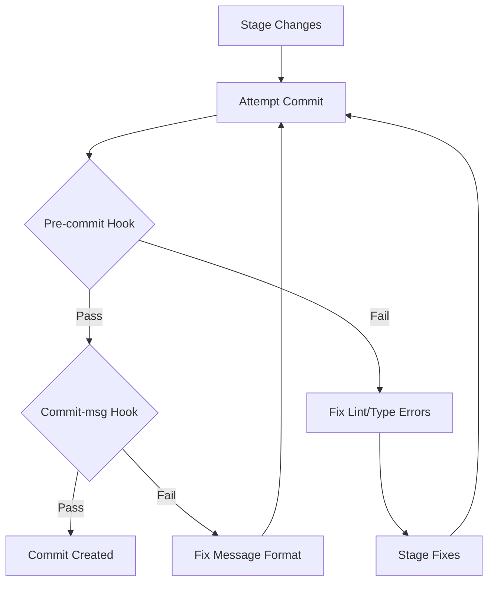

# Commit Instructions for AI Agents

This document provides guidance for AI agents when making commits in this repository. Follow these instructions to ensure successful commits that pass all hooks and validation.

## Commit Message Format

This project uses **Conventional Commits**. All commit messages MUST follow this format:

```
type(scope): description
```

### Required Format

| Component       | Rules                                                                                                          |
| --------------- | -------------------------------------------------------------------------------------------------------------- |
| **type**        | Required. One of: `feat`, `fix`, `docs`, `style`, `refactor`, `test`, `chore`, `perf`, `ci`, `build`, `revert` |
| **scope**       | Optional. Matches spec directory name (e.g., `optimize`, `gems`, `auth`)                                       |
| **description** | Required. Starts with lowercase, max 72 characters, no trailing period                                         |

### Valid Types

| Type       | When to Use                         | Changelog Section |
| ---------- | ----------------------------------- | ----------------- |
| `feat`     | New feature                         | Added             |
| `fix`      | Bug fix                             | Fixed             |
| `docs`     | Documentation only                  | -                 |
| `style`    | Code style (formatting, whitespace) | -                 |
| `refactor` | Code refactoring                    | Changed           |
| `test`     | Adding/updating tests               | -                 |
| `chore`    | Maintenance tasks                   | -                 |
| `perf`     | Performance improvement             | Changed           |
| `ci`       | CI/CD changes                       | -                 |
| `build`    | Build system changes                | -                 |
| `revert`   | Revert previous commit              | -                 |

### Commit Message Examples

```bash
# Feature with scope
feat(optimize): add greedy algorithm for gem ranking

# Bug fix without scope
fix: resolve gem selector search filter

# Breaking change
feat(auth)!: change OAuth callback signature

BREAKING CHANGE: The OAuth callback now requires a state parameter.

# Multiple issues
fix(gems): correct resonance calculation for 5-star gems

Closes #123, #124
```

---

## Pre-Commit Hook Validation

Before every commit, the pre-commit hook runs:

1. **ESLint** (`bun lint`)
2. **TypeScript** (`bun typecheck`)

### If Pre-Commit Fails

#### ESLint Errors

```
Error: ESLint found problems in your code
```

**Resolution**:

1. Run `bun lint --fix` to auto-fix formatting issues
2. Manually fix remaining errors
3. Stage the fixes: `git add -A`
4. Retry the commit

#### TypeScript Errors

```
Error: Type 'X' is not assignable to type 'Y'
```

**Resolution**:

1. Review the type error in the output
2. Fix type mismatches in the affected files
3. Verify fix with `bun typecheck`
4. Stage and retry the commit

---

## Commit Message Validation (commitlint)

If your commit message is rejected:

### Error: `type-enum`

```
⧗   input: update the gem selector
✖   type must be one of [feat, fix, docs, style, refactor, test, chore, perf, ci, build, revert]
```

**Resolution**: Add a valid type prefix

```bash
# Wrong
git commit -m "update the gem selector"

# Correct
git commit -m "feat: add gem selector search filter"
# or
git commit -m "fix: resolve gem selector bug"
```

### Error: `subject-case`

```
✖   subject must be lower-case
```

**Resolution**: Start description with lowercase

```bash
# Wrong
git commit -m "feat: Add gem selector"

# Correct
git commit -m "feat: add gem selector"
```

### Error: `subject-max-length`

```
✖   subject must not be longer than 72 characters
```

**Resolution**: Shorten the description or add a body

```bash
# Wrong - description too long
git commit -m "feat: add a really long description that exceeds the maximum allowed length for commit messages"

# Correct - shorter description
git commit -m "feat: add gem selector with search filter"

# Or use body for details
git commit -m "feat: add gem selector" -m "Add a searchable gem selector component with filtering by star rating and tier"
```

---

## Failure Scenarios & Recovery

### Scenario 1: Hook Failure Loop

If you're stuck in a loop of hook failures:

1. **Stop** attempting commits
2. **Run diagnostics**:
   ```bash
   bun lint
   bun typecheck
   ```
3. **Fix all errors** before attempting another commit
4. If errors persist, check for conflicting dependencies or config

### Scenario 2: Merge Conflicts

If merge conflicts occur during rebase/merge:

1. **Check affected files**: `git status`
2. **Open each conflicted file** and look for conflict markers:
   ```
   <<<<<<< HEAD
   current changes
   =======
   incoming changes
   >>>>>>> branch-name
   ```
3. **Resolve conflicts** by keeping correct code
4. **Update spec documents** if merge affects feature specs
5. **Stage resolved files**: `git add <files>`
6. **Continue**: `git rebase --continue` or `git commit`

### Scenario 3: Invalid Commit Message Format

If commitlint rejects your message:

1. **Read the error** - it tells you exactly what's wrong
2. **Refer to format rules** above
3. **Rewrite the commit**:
   ```bash
   git commit --amend -m "correct type: description"
   ```
4. If already pushed, use new commit:
   ```bash
   git commit -m "correct type: description"
   ```

### Scenario 4: Forgotten to Stage Files

If hook passes but you realize you forgot files:

1. **Stage the missing files**: `git add <files>`
2. **Amend the commit**: `git commit --amend --no-edit`
3. **Force push if needed** (only on your own branch): `git push --force-with-lease`

---

## Complete Commit Workflow



---

## Quick Reference

### Always Do

- ✅ Use conventional commit type prefix
- ✅ Start description with lowercase
- ✅ Keep description under 72 characters
- ✅ Run `bun lint --fix` before committing
- ✅ Run `bun typecheck` to verify types
- ✅ Reference issues when applicable

### Never Do

- ❌ Skip hooks with `--no-verify` (unless explicitly instructed)
- ❌ Use uppercase in description
- ❌ End description with period
- ❌ Use vague messages like "fix bug" or "update code"
- ❌ Commit without staging all related files

---

## Changelog Impact

Your commit type determines changelog placement:

| Commit Type        | Changelog Section                       |
| ------------------ | --------------------------------------- |
| `feat`             | **Added** - New features                |
| `fix`              | **Fixed** - Bug fixes                   |
| `refactor`, `perf` | **Changed** - Improvements              |
| `deprecate`        | **Deprecated** - Features being removed |
| `remove`           | **Removed** - Deleted features          |
| `security`         | **Security** - Security fixes           |

---

## Release-Please Workflow

This project uses **release-please-action** for automated changelog and release management.

### How It Works

1. **Push to main**: When commits are pushed to `main`, release-please creates/updates a Release PR
2. **Review Release PR**: The Release PR contains:
   - CHANGELOG.md updates organized by commit type
   - package.json version bump
   - Release notes summary
3. **Merge Release PR**: When merged:
   - GitHub release is created
   - Version tag is created (e.g., `v0.1.0`)
   - CHANGELOG.md is committed to main

### Version Bump Logic

| Commit Type                    | Version Bump          |
| ------------------------------ | --------------------- |
| `feat:`                        | MINOR (0.1.0 → 0.2.0) |
| `fix:`                         | PATCH (0.1.0 → 0.1.1) |
| `feat!:` or `BREAKING CHANGE:` | MAJOR (0.1.0 → 1.0.0) |

### Release PR Handling

When a Release PR is created:

1. **Review the changelog**: Verify commit grouping is correct
2. **Check version bump**: Ensure version increment matches breaking changes
3. **Merge when ready**: Merging triggers the release

### Example Release PR

```markdown
## 0.2.0 (2026-02-15)

### Added

- feat: add gem selector component (#42)
- feat: implement greedy optimization algorithm (#44)

### Fixed

- fix: resolve resonance calculation error (#43)

### Changed

- refactor: simplify auth flow (#45)
```

### Release PR Conflicts

If the Release PR has conflicts:

1. **Update main branch** with latest changes
2. **Close the Release PR** - release-please will recreate it
3. **Or manually resolve** conflicts in CHANGELOG.md

### Multiple Releases

If you need to release multiple times:

1. Merge feature PRs to main
2. Wait for release-please to update the Release PR
3. Review and merge the Release PR
4. Repeat for next release

---

## Need Help?

If you encounter issues not covered here:

1. Check `.kilocode/rules/memory-bank/` for project-specific context
2. Review `specs/001-workflow-foundation/` for workflow documentation
3. Run `bun lint` and `bun typecheck` separately for detailed error output
4. Check GitHub Actions tab for release-please workflow errors
