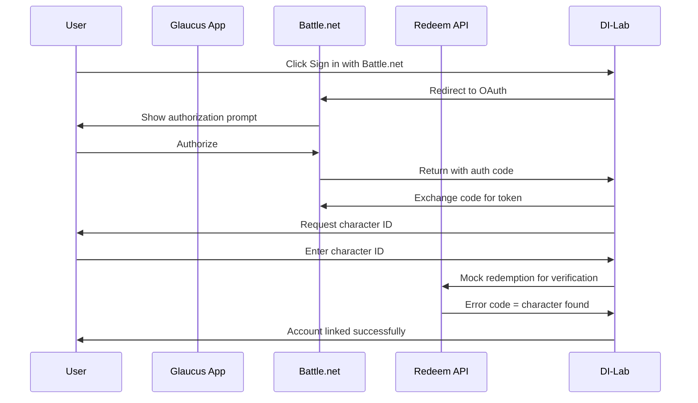

# System Patterns: Glaucus App (Diablo Immortal Legendary Gems Optimizer)

## Architecture Overview

```
src/
├── app/                    # Next.js App Router
│   ├── layout.tsx          # Root layout + metadata
│   ├── page.tsx            # Home page
│   ├── globals.css         # Tailwind imports + global styles
│   ├── api/                # API routes
│   │   ├── auth/[...nextauth]/  # Battle.net OAuth
│   │   └── optimize/       # Optimization endpoint
│   ├── optimize/           # Optimization page
│   └── builds/             # Saved builds page
├── components/
│   ├── ui/                 # Reusable UI components
│   ├── gems/               # Gem-related components
│   ├── optimization/       # Optimization components
│   └── layout/             # Layout components
├── lib/
│   ├── db/                 # Drizzle schema & queries
│   ├── auth/               # Auth configuration
│   ├── optimization/       # Optimization algorithms
│   └── external/           # External API clients
└── types/                  # TypeScript type definitions
```

## Key Design Patterns

### 1. App Router Pattern

Uses Next.js App Router with file-based routing:

```
src/app/
├── page.tsx           # Route: /
├── optimize/page.tsx  # Route: /optimize
├── builds/
│   ├── page.tsx       # Route: /builds
│   └── [id]/page.tsx  # Route: /builds/:id
└── api/
    └── optimize/route.ts  # API Route: /api/optimize
```

### 2. Component Organization Pattern

```
src/components/
├── ui/                # Reusable UI components (Button, Card, etc.)
├── gems/              # GemSelector, GemCard, GemList
├── optimization/      # OptimizationResult, ResourceInput
└── layout/            # Header, Footer, Sidebar
```

### 3. Server Components by Default

All components are Server Components unless marked with `"use client"`:

```tsx
// Server Component (default) - can fetch data, access DB
export default function OptimizePage() {
  const gems = await db.select().from(legendaryGems);
  return <GemSelector gems={gems} />;
}

// Client Component - for interactivity
"use client";
export default function GemSelector({ gems }: { gems: Gem[] }) {
  const [selected, setSelected] = useState<Gem[]>([]);
  return (
    <div>
      {gems.map(gem => (
        <GemCard key={gem.id} gem={gem} onSelect={() => ...} />
      ))}
    </div>
  );
}
```

### 4. Optimization Engine Pattern

```tsx
// src/lib/optimization/engine.ts
interface OptimizationInput {
  gems: EquippedGem[];
  resources: Resources;
  goals: OptimizationGoals;
}

interface OptimizationResult {
  recommendations: UpgradeRecommendation[];
  expectedPowerGain: number;
  resourceUsage: Resources;
}

export function optimize(input: OptimizationInput): OptimizationResult {
  // 1. Analyze current build
  // 2. Calculate possible upgrades within resource constraints
  // 3. Rank upgrades by power gain per resource cost
  // 4. Return prioritized recommendations
}
```

## Data Models

### Legendary Gem

```typescript
interface LegendaryGem {
  id: string;
  name: string;
  quality: 1 | 2 | 3 | 4 | 5; // Star rating
  rank: number; // 1-10
  stats: GemStats;
  upgradeCost: UpgradeCost;
}
```

### User Build

```typescript
interface UserBuild {
  id: string;
  userId: string;
  gems: EquippedGem[];
  resources: Resources;
  createdAt: Date;
  updatedAt: Date;
}
```

## Styling Conventions

### Tailwind CSS Usage

- Utility classes directly on elements
- Component composition for repeated patterns
- Responsive: `sm:`, `md:`, `lg:`, `xl:`

### Common Patterns

```tsx
// Container
<div className="max-w-7xl mx-auto px-4 sm:px-6 lg:px-8">

// Responsive grid
<div className="grid grid-cols-1 md:grid-cols-2 lg:grid-cols-3 gap-6">

// Flexbox centering
<div className="flex items-center justify-center">
```

## File Naming Conventions

- Components: PascalCase (`Button.tsx`, `GemSelector.tsx`)
- Utilities: camelCase (`utils.ts`, `optimization.ts`)
- Pages/Routes: lowercase (`page.tsx`, `layout.tsx`)
- Directories: kebab-case (`api-routes/`) or lowercase (`components/`)

## State Management

For simple needs:

- `useState` for local component state
- `useContext` for shared state (user, theme)
- Server Components for data fetching

For complex needs (add when necessary):

- Zustand for client state
- React Query for server state (caching API calls)

## Authentication Flow



## External API Integration

### Battle.net OAuth

```typescript
// src/lib/auth/battlenet.ts
export const authOptions: NextAuthOptions = {
  providers: [
    BattleNetProvider({
      clientId: process.env.BATTLENET_CLIENT_ID,
      clientSecret: process.env.BATTLENET_CLIENT_SECRET,
    }),
  ],
};
```

### Diablo.tv Integration

```typescript
// src/lib/external/diablo-tv.ts
export async function getDIDays(): Promise<DIDay[]> {
  // Fetch current DI days/events from diablo.tv
}
```

### Character Verification

```typescript
// src/lib/external/redeem-api.ts
export async function verifyCharacter(
  characterId: string,
): Promise<VerificationResult> {
  // Use mock redemption code to verify character exists
  // API returns informative error codes
}
```
