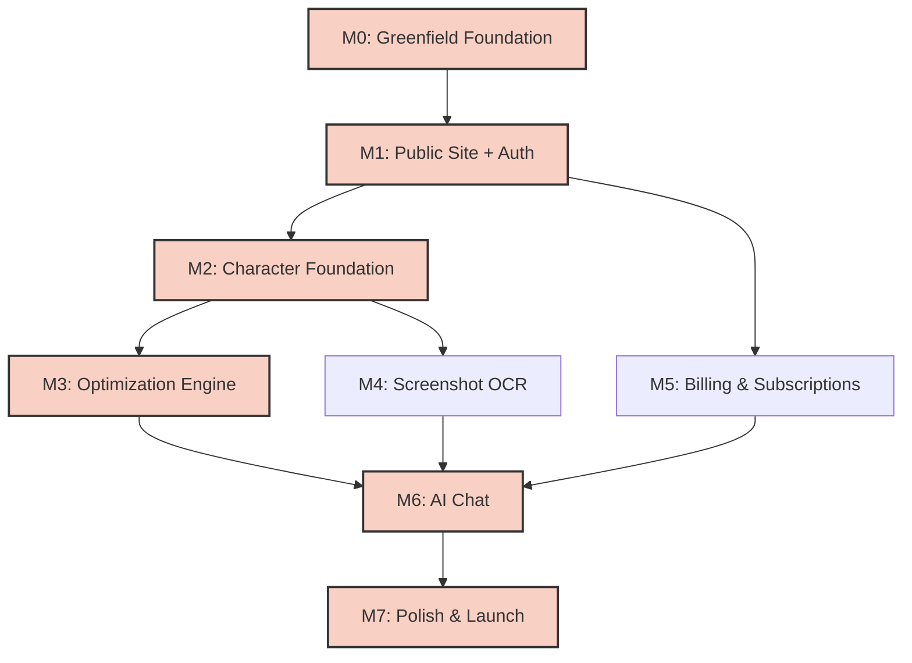

# Implementation Roadmap (ROADMAP.md) — Glaucus App

> **Document Status:** Draft
> **Date:** 2026-06-05
> **Inputs:** `docs/PRD.md`, `docs/FEATURES.md`, `docs/TARGET-ARCHITECTURE.md`
> **Purpose:** Sequence all features into shippable milestones for parallel development by AI agents (poles).

---

## 1. Overall Timeline Estimate

| Milestone | Focus Area              | Estimated Duration | Target Release |
| --------- | ----------------------- | ------------------ | -------------- |
| M0        | Greenfield Foundation   | 1 week             | Week 1         |
| M1        | Public Site + Auth      | 2 weeks            | Week 3         |
| M2        | Character Foundation    | 3 weeks            | Week 6         |
| M3        | Optimization Engine     | 2 weeks            | Week 8         |
| M4        | Screenshot OCR          | 2 weeks            | Week 10        |
| M5        | Billing & Subscriptions | 2 weeks            | Week 12        |
| M6        | AI Chat                 | 2 weeks            | Week 14        |
| M7        | Polish & Launch         | 2 weeks            | Week 16        |

**Total Estimated Timeline:** 16 weeks (4 months) for full feature parity.

---

## 2. Critical Path Analysis

**Critical Path:** M0 → M1 → M2 → M3 → M6 → M7

- Auth (M1) blocks Character management (M2).
- Character management (M2) blocks Optimization Engine (M3) and OCR (M4).
- Optimization (M3) and OCR (M4) must complete before AI Chat (M6) can inject meaningful context.

---

## 3. Suggested Parallel Work Streams

To maximize throughput, multiple poles can work in parallel on non-dependent milestones:

- **Stream A (Core Logic):** M0 → M1 → M2 → M3 → M6 → M7
- **Stream B (UI/UX & Public):** M0 → M1 (Landing page only) → M7 (Polish)
- **Stream C (Integrations):** M1 (Auth setup) → M5 (Billing) → M6 (AI Chat backend)
- **Stream D (Data Pipeline):** M2 (Character DB) → M4 (OCR processing)

---

## 4. Database Schema Strategy

**Constraint:** We are recreating the database schema from scratch. **No legacy migrations are needed.**

- **Approach:** Define the final target schema in `src/lib/db/schema.ts` using Drizzle ORM.
- **Initialization:** Use `drizzle-kit push` (development) or `drizzle-kit generate` + `migrate` (production) to create the schema fresh.
- **Tables to create:** `users`, `anonymous_sessions`, `characters`, `builds`, `build_equipment`, `build_gems`, `build_resources`, `subscriptions`, `ocr_jobs`, `chat_sessions`, `chat_messages`.
- **Safety:** Since this is a fresh schema, we do not need backward-compatible migration scripts. Data loss is acceptable during the M0 restructure phase.

---

## 5. API Strategy

All APIs use versioned routes from the start to maintain clean contracts:

- **API Prefix:** All endpoints use `/api/v1/` prefix (e.g., `/api/v1/optimize`, `/api/v1/builds`, `/api/v1/characters`, `/api/v1/chat`).
- **Strategy:**
  - Use `/api/v1/` for all endpoints from M1 forward.
  - The old application's API patterns inform the new design but are not maintained for backward compatibility.

---

## 6. Page Architecture Strategy

The new application follows a clean, specification-driven architecture:

- **Landing & Demo:** `/page.tsx` (root) hosts the landing page with interactive demo.
- **Optimizer:** `/optimize/page.tsx` provides the core gem optimization interface.
- **Builds:** `/builds/page.tsx` for build management (save, load, delete).
- **Characters:** `/characters/page.tsx` for character management (available M2+).
- **Chat:** `/chat/page.tsx` for AI chat feature (available M6+).

---

## 7. Milestone Definitions

### Milestone 0: Greenfield Foundation

The old application codebase is deprecated. This milestone establishes fresh, clean architecture for the new implementation.

**Goal:** Establish the target directory skeleton, type system, and error-handling infrastructure for the new Glaucus implementation.

- **Included Features:** Infrastructure setup (no user-facing features).
- **Estimated Effort:** M (Medium)
- **Technical Prerequisites:** None.
- **Acceptance Criteria:**
  - [ ] `src/features/` directory structure matches `TARGET-ARCHITECTURE.md`.
  - [ ] Fresh Drizzle schema defined in `src/lib/db/schema.ts`.
  - [ ] `bun typecheck`, `bun lint`, and `bun build` pass with 0 errors.
- **Risks & Mitigations:**
  - _Risk:_ Breaking existing optimizer during refactor.
  - _Mitigation:_ Old code is archived; new modules follow specification-first development with comprehensive testing.
- **Suggested Team Size:** 1 polecat.

---

### Milestone 1: Public Site + Auth

**Goal:** Establish the marketing front door and secure user identity.

- **Included Features:** F01 (Auth), F02 (Profile), F04 (Nav Shell), F25 (Landing Page), F26 (Demo), F27 (FAQ), F28 (Social Proof).
- **Estimated Effort:** L (Large)
- **Technical Prerequisites:** M0 complete. NextAuth 5 configured.
- **Acceptance Criteria:**
  - [ ] Users can sign in via Battle.net OAuth.
  - [ ] Anonymous session data successfully migrates to new user account upon signup.
  - [ ] Landing page loads with LCP < 2.5s.
- **Risks & Mitigations:**
  - _Risk:_ Battle.net OAuth callback failures in dev.
  - _Mitigation:_ Implement robust mock auth provider for local development.
- **Suggested Team Size:** 2 polecats (1 on Auth, 1 on Public Site).

---

### Milestone 2: Character Foundation

**Goal:** Enable users to create and manage their Diablo Immortal characters and basic builds.

- **Included Features:** F06 (Character CRUD), F07 (Equipment Screen), F08 (Inventory), F09 (Gem Management), F10 (Stats Calculation), F11 (Manual Item Entry), F14 (Database Browsing).
- **Estimated Effort:** L (Large)
- **Technical Prerequisites:** M1 complete. Fresh DB schema deployed.
- **Acceptance Criteria:**
  - [ ] Users can create a character with class, gender, and name.
  - [ ] Equipment paper doll renders correctly with equipped items.
  - [ ] Stats panel accurately calculates derived values from equipped items/gems.
- **Risks & Mitigations:**
  - _Risk:_ Stat calculation formulas are incorrect.
  - _Mitigation:_ Implement property-based testing for all stat calculation functions against known `docs/*.csv` data.
- **Suggested Team Size:** 2 polecats (1 on Character/Inventory CRUD, 1 on Stats/Equipment UI).

---

### Milestone 3: Optimization Engine

**Goal:** Build the core optimization algorithm and integrate it with character data.

- **Included Features:** F15 (Playstyle Presets), F16 (Advanced Algorithm), F17 (Before/After UI), F18 (What-If Scenarios), F19 (Build Versioning).
- **Estimated Effort:** L (Large)
- **Technical Prerequisites:** M2 complete. Character and build data models are stable.
- **Acceptance Criteria:**
  - [ ] Advanced algorithm completes optimization for 10 gems in < 5 seconds.
  - [ ] What-if scenarios update UI instantly without mutating saved build.
  - [ ] Optimizer UI renders correctly with character context.
- **Risks & Mitigations:**
  - _Risk:_ Advanced algorithm exceeds 5s timeout.
  - _Mitigation:_ Implement Web Workers for client-side computation or optimize server-side DP with memoization.
- **Suggested Team Size:** 2 polecats (1 on Algorithm/Backend, 1 on What-If/Comparison UI).

---

### Milestone 4: Screenshot OCR

**Goal:** Automate item and gem intake via image processing.

- **Included Features:** F12 (Equipment OCR), F13 (Inventory OCR).
- **Estimated Effort:** M (Medium)
- **Technical Prerequisites:** M2 complete (Inventory/Equipment models exist). Tesseract.js integrated.
- **Acceptance Criteria:**
  - [ ] Users can upload a screenshot and receive a parsed JSON result.
  - [ ] OCR Review UI allows users to correct misidentified items before saving.
  - [ ] Process completes in < 10 seconds for a standard 1080p screenshot.
- **Risks & Mitigations:**
  - _Risk:_ Tesseract.js accuracy is too low for DI UI fonts.
  - _Mitigation:_ Pre-process images (grayscale, contrast enhancement) and provide a highly visible manual correction UI.
- **Suggested Team Size:** 1 polecat.

---

### Milestone 5: Billing & Subscriptions

**Goal:** Monetize the application and gate premium features.

- **Included Features:** F03 (Subscription/Billing), F20 (Build Sharing).
- **Estimated Effort:** M (Medium)
- **Technical Prerequisites:** M1 complete (User accounts exist). Stripe account configured.
- **Acceptance Criteria:**
  - [ ] Users can successfully complete a Stripe Checkout session.
  - [ ] Webhook correctly updates user `tier` in the database.
  - [ ] Tier 1 users can access OCR features; Free users see upgrade prompts.
- **Risks & Mitigations:**
  - _Risk:_ Webhook delivery failures cause tier desync.
  - _Mitigation:_ Implement webhook retry logic and a manual "Sync Subscription" button in user settings.
- **Suggested Team Size:** 1 polecat.

---

### Milestone 6: AI Chat

**Goal:** Provide natural language assistance powered by the Kilo LLM Gateway.

- **Included Features:** F21 (Chat Interface), F22 (Context Injection), F23 (Chat History), F24 (Safety Guardrails).
- **Estimated Effort:** L (Large)
- **Technical Prerequisites:** M2 (Character data), M3 (Optimization context), M5 (Tier 2 gating).
- **Acceptance Criteria:**
  - [ ] Chat API successfully injects structured character/build context into Kilo LLM Gateway prompts.
  - [ ] Responses are streamed to the UI with < 5s time-to-first-token.
  - [ ] Guardrails prevent the AI from hallucinating non-existent game mechanics.
- **Risks & Mitigations:**
  - _Risk:_ LLM context window exceeds limits or becomes too expensive.
  - _Mitigation:_ Summarize character data before injection; implement strict token limits in the Kilo Gateway configuration.
- **Suggested Team Size:** 2 polecats (1 on LLM integration/prompt engineering, 1 on Chat UI/streaming).

---

### Milestone 7: Polish & Launch

**Goal:** Finalize the application for public release.

- **Included Features:** F05 (Settings/Preferences), UI polish, performance optimization, security review, documentation.
- **Estimated Effort:** M (Medium)
- **Technical Prerequisites:** All previous milestones complete.
- **Acceptance Criteria:**
  - [ ] Lighthouse scores > 90 across all pages.
  - [ ] All E2E tests pass in CI/CD pipeline.
  - [ ] `docs/` folder is fully updated with this PRD, FEATURES, and ROADMAP.
- **Risks & Mitigations:**
  - _Risk:_ Last-minute bug discoveries.
  - _Mitigation:_ Freeze feature development 1 week prior to launch; dedicate entirely to bug fixing and performance tuning.
- **Suggested Team Size:** 2 polecats (1 on QA/Testing, 1 on Performance/Docs).

---

## 8. Next Steps for Execution

1. **Approve this Roadmap:** Confirm milestone sequencing and effort estimates.
2. **Execute M0:** Begin project restructure and fresh schema definition.
3. **Spawn Polecats:** Assign specific poles to Stream A, B, C, and D based on the parallel work streams defined above.
4. **Track Progress:** Update `.kilocode/rules/memory-bank/context.md` after each milestone completion.
