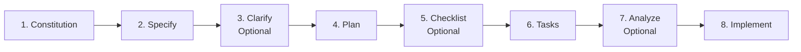

# Spec-Driven Development (SDD) Workflow

This directory contains all feature specifications for DI-Lab, following the Spec-Driven Development methodology aligned with [GitHub Spec Kit](https://github.com/github/spec-kit).

## ⚠️ CRITICAL: Human-in-the-Loop Validation

**This workflow enforces mandatory human validation checkpoints between every phase.**

### Why Human Checkpoints Are Non-Negotiable

| Risk                      | Consequence                                            | Prevention                             |
| ------------------------- | ------------------------------------------------------ | -------------------------------------- |
| Workflow Hallucinations   | Agents assume default behaviors for optional steps     | User explicitly confirms each artifact |
| Incorrect Interpretations | Cascading errors propagate through all phases          | User analyzes output before proceeding |
| Specification Drift       | Implementation diverges from intent                    | Human review as primary safeguard      |
| Lost Customization        | Optional steps become inaccessible when auto-advancing | Gatekeeping enforces user choice       |

### The Human Checkpoint Protocol

**ALL AGENTS MUST PAUSE AFTER PRODUCING ANY ARTIFACT:**

```
1. Agent produces artifact (spec, plan, tasks, or implementation)
2. Agent STOPS and presents artifact to user
3. User analyzes and provides explicit confirmation
4. Only after user approval → Agent proceeds to next phase
```

**NO PHASE TRANSITION OCCURS WITHOUT USER APPROVAL.**

---

## Directory Structure

```text
.specify/
├── memory/
│   └── constitution.md        # Foundational principles
├── scripts/
│   └── bash/                  # Automation scripts
└── templates/                 # Document templates

specs/
├── feature/
│   ├── PROJ-001-workflow-foundation/   # Meta-workflow infrastructure
│   │   └── spec.md                     # Master specification
│   └── PROJ-002-optimizer-ui/          # Optimizer UI feature
│       └── ...
└── README.md                           # This file
```

---

## Spec-Kit Workflow

This project follows the [Spec Kit](https://github.com/github/spec-kit) workflow:



### Phase Commands

| Phase        | Command                 | Purpose                           | Required    |
| ------------ | ----------------------- | --------------------------------- | ----------- |
| Constitution | `/speckit.constitution` | Establish foundational principles | ✅ Yes      |
| Specify      | `/speckit.specify`      | Create feature specification      | ✅ Yes      |
| Clarify      | `/speckit.clarify`      | Resolve underspecified areas      | ⚪ Optional |
| Plan         | `/speckit.plan`         | Create implementation plan        | ✅ Yes      |
| Checklist    | `/speckit.checklist`    | Verify requirements completeness  | ⚪ Optional |
| Tasks        | `/speckit.tasks`        | Generate actionable tasks         | ✅ Yes      |
| Analyze      | `/speckit.analyze`      | Cross-artifact consistency check  | ⚪ Optional |
| Implement    | `/speckit.implement`    | Execute implementation            | ✅ Yes      |

### Enhanced Quality Commands

These optional commands provide additional quality assurance:

| Command              | When to Use                                         | Output                         |
| -------------------- | --------------------------------------------------- | ------------------------------ |
| `/speckit.clarify`   | Before `/speckit.plan` if spec has ambiguities      | Clarified specification areas  |
| `/speckit.analyze`   | After `/speckit.tasks` for consistency validation   | Cross-artifact analysis report |
| `/speckit.checklist` | After `/speckit.plan` for requirements completeness | Quality checklist              |

---

## Workflow Phases with Checkpoints

### Phase 1: Specification Creation

**Agent Action**: Create specification document at `specs/<###>-<feature-name>/spec.md`

**Agent MUST Include**:

- User stories with acceptance criteria
- Functional requirements (FR-XXX)
- Key entities and data models
- Success criteria (SC-XXX)

**🛑 CHECKPOINT GATE**:

```
Agent presents spec.md to user
User reviews for:
  □ Correct scope and priorities
  □ Complete acceptance criteria
  □ Accurate data models
  □ Any missing requirements
User provides: "Approved" or "Changes needed: [details]"
Agent proceeds ONLY after approval
```

---

### Phase 2: Clarify (Optional)

**Agent Action**: Run `/speckit.clarify` to identify and resolve underspecified areas

**When to Use**:

- Specification contains ambiguous requirements
- Missing acceptance criteria
- Unclear data relationships
- Domain knowledge gaps

**🛑 CHECKPOINT GATE**:

```
Agent presents clarified questions/answers to user
User reviews for:
  □ All clarifications accurate
  □ No new ambiguities introduced
User provides: "Approved" or "Additional clarification needed: [details]"
Agent proceeds ONLY after approval
```

---

### Phase 3: Planning

**Agent Action**: Create implementation plan at `specs/<###>-<feature-name>/plan.md`

**Agent MUST Include**:

- Technical context and constraints
- Architecture decisions
- Phase breakdown with dependencies
- Risk mitigation strategies

**🛑 CHECKPOINT GATE**:

```
Agent presents plan.md to user
User reviews for:
  □ Feasible technical approach
  □ Correct phase ordering
  □ Acceptable risk mitigation
  □ Any architectural concerns
User provides: "Approved" or "Changes needed: [details]"
Agent proceeds ONLY after approval
```

---

### Phase 4: Checklist (Optional)

**Agent Action**: Run `/speckit.checklist` to verify requirements completeness

**When to Use**:

- Complex specifications with many requirements
- Safety-critical or security-sensitive features
- Before task decomposition to catch gaps

**🛑 CHECKPOINT GATE**:

```
Agent presents checklist results to user
User reviews for:
  □ All critical requirements covered
  □ No missing edge cases
User provides: "Approved" or "Add requirements: [details]"
Agent proceeds ONLY after approval
```

---

### Phase 5: Task Decomposition

**Agent Action**: Generate actionable tasks at `specs/<###>-<feature-name>/tasks.md`

**Agent MUST Include**:

- Task IDs (T001, T002, etc.)
- User story references
- Acceptance criteria per task
- Dependencies and parallel opportunities

**🛑 CHECKPOINT GATE**:

```
Agent presents tasks.md to user
User reviews for:
  □ Complete task coverage
  □ Correct dependency ordering
  □ Reasonable task granularity
  □ Any missing tasks
User provides: "Approved" or "Changes needed: [details]"
Agent proceeds ONLY after approval
```

---

### Phase 6: Analyze (Optional)

**Agent Action**: Run `/speckit.analyze` for cross-artifact consistency validation

**When to Use**:

- Large specifications with many artifacts
- Multiple linked features
- Before implementation to catch inconsistencies

**🛑 CHECKPOINT GATE**:

```
Agent presents analysis report to user
User reviews for:
  □ No orphaned requirements
  □ All tasks trace to user stories
  □ Consistent terminology
User provides: "Approved" or "Fix inconsistencies: [details]"
Agent proceeds ONLY after approval
```

---

### Phase 7: GitHub Issue Creation

**Agent Action**: Create GitHub Issues from tasks

**Agent MUST Include**:

- Parent issue with spec content
- Child issues with task details
- Bidirectional sync frontmatter

**🛑 CHECKPOINT GATE**:

```
Agent presents issue URLs to user
User reviews for:
  □ Correct issue hierarchy
  □ Complete frontmatter
  □ Proper labeling
User provides: "Approved" or "Changes needed: [details]"
Agent proceeds ONLY after approval
```

---

### Phase 8: Implementation

**Agent Action**: Implement tasks sequentially

**For Each Task**:

1. Create branch: `feature/<id>-<###>-<feature-name>`
2. Implement task
3. Commit with conventional format: `feat(scope): description`
4. Create PR referencing spec

**🛑 CHECKPOINT GATE** (per task):

```
Agent presents completed task to user
User reviews for:
  □ Correct implementation
  □ All acceptance criteria met
  □ Tests passing (if applicable)
User provides: "Approved - merge" or "Changes needed: [details]"
Agent proceeds to next task ONLY after approval
```

---

### Phase 9: Merge & Sync

**Agent Action**: Merge PR and sync spec

**Agent MUST**:

- Update task checkbox in tasks.md
- Verify changelog entry
- Close related issues

**🛑 CHECKPOINT GATE**:

```
Agent presents merge result to user
User reviews for:
  □ Changelog entry correct
  □ Task checkboxes updated
  □ Issues closed properly
User provides: "Complete" or "Issues found: [details]"
```

---

## Branch Naming Convention

| Type    | Pattern                             | Example                          |
| ------- | ----------------------------------- | -------------------------------- |
| Feature | `feature/<identifier>-<###>-<name>` | `feature/PROJ-001-gem-optimizer` |
| Fix     | `fix/<identifier>-<###>-<name>`     | `fix/PROJ-001-login-error`       |

## Commit Message Format

All commits MUST follow Conventional Commits:

```
type(scope): description
```

See `.kilocode/rules/commit.md` for complete guidelines.

## Changelog Sections

| Commit Type        | Changelog Section |
| ------------------ | ----------------- |
| `feat`             | Added             |
| `fix`              | Fixed             |
| `refactor`, `perf` | Changed           |
| `deprecate`        | Deprecated        |
| `remove`           | Removed           |
| `security`         | Security          |

## Issue Templates

Use the appropriate template when creating issues:

- **bug_report.md**: Report bugs with reproduction steps
- **feature_request.md**: Request features with user story format
- **task.md**: Create tasks with Spec Kit frontmatter

## PR Checklist

All PRs must include:

- [ ] Spec reference (spec ID, task IDs)
- [ ] Changelog entry
- [ ] Spec-task sync verification
- [ ] All pre-commit checks passing

## Spec Kit Frontmatter

Task issues MUST include this frontmatter for bidirectional sync:

```yaml
---
spec_id: "000-workflow-foundation"
task_id: "T001"
issue_url: "" # Populated when GitHub issue is created
parent_issue: "" # URL of parent spec issue
---
```

---

## Consequences of Skipping Checkpoints

### What Happens When Agents Auto-Advance

| Phase Skipped         | Cascading Errors                             |
| --------------------- | -------------------------------------------- |
| Spec Review           | Incorrect assumptions propagate to all tasks |
| Plan Review           | Unfeasible architecture implemented          |
| Task Review           | Missing requirements discovered late         |
| Implementation Review | Bugs and technical debt accumulate           |

### The Safeguard

**Human checkpoints are the PRIMARY safeguard against specification drift.**

When in doubt:

1. **STOP** - Do not proceed
2. **PRESENT** - Show current artifact to user
3. **WAIT** - For explicit approval
4. **ONLY THEN** - Proceed to next phase

---

## Related Documentation

- [Constitution](../memory/constitution.md) - Project principles
- [Commit Rules](../../.kilocode/rules/commit.md) - Commit guidelines
- [Memory Bank](../../.kilocode/rules/memory-bank/) - Project context
- [Spec Kit](https://github.com/github/spec-kit) - Official documentation
